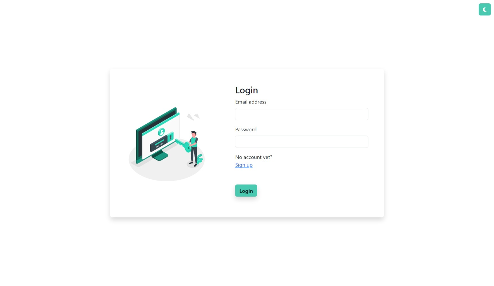
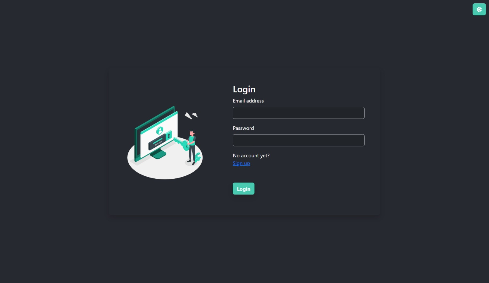
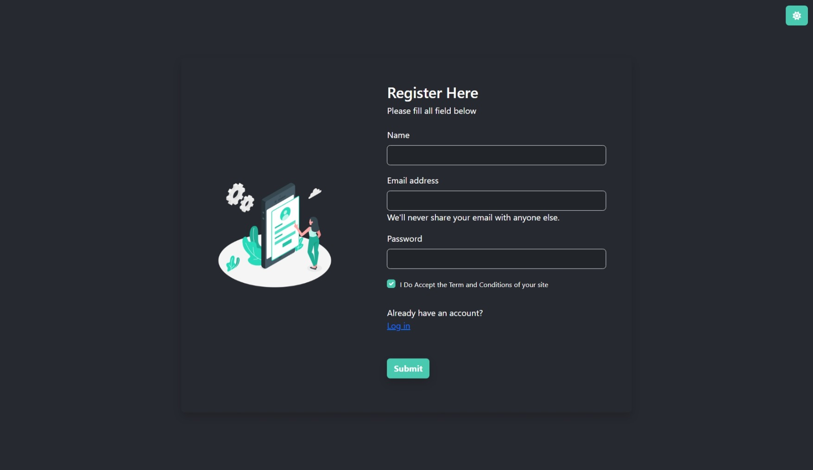
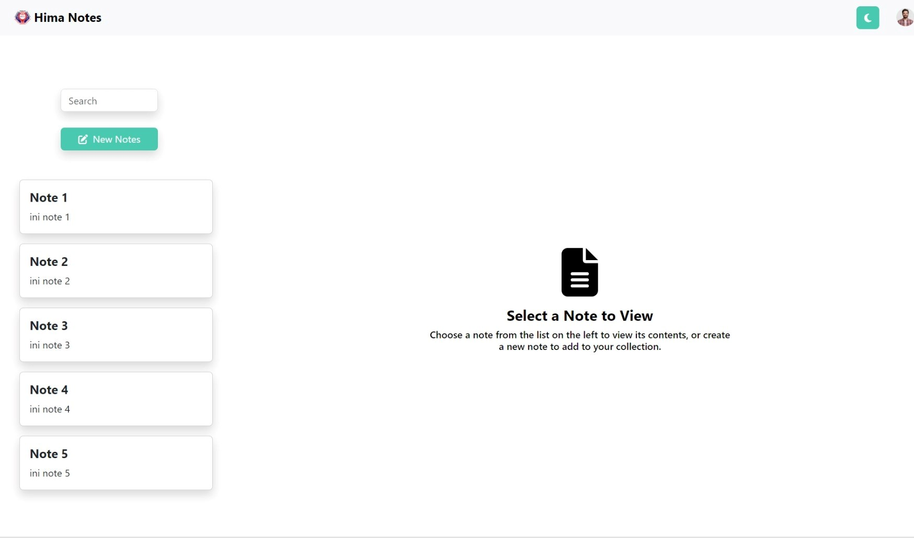
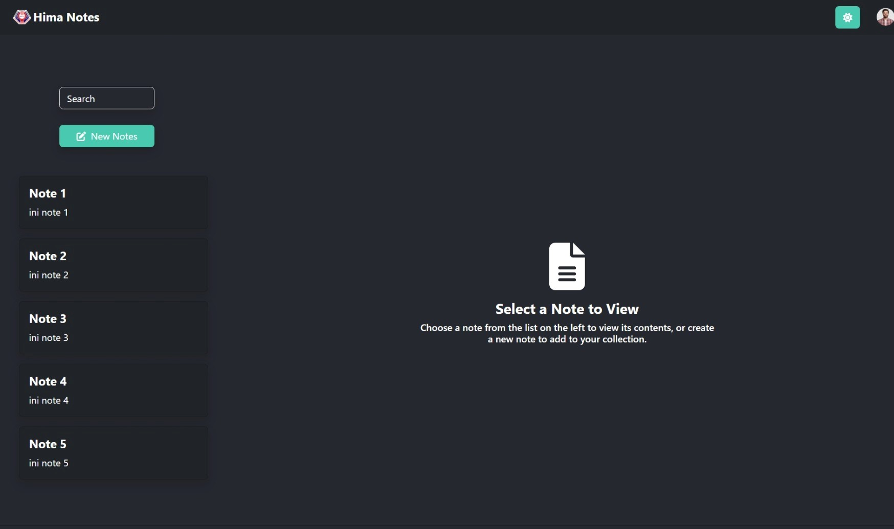
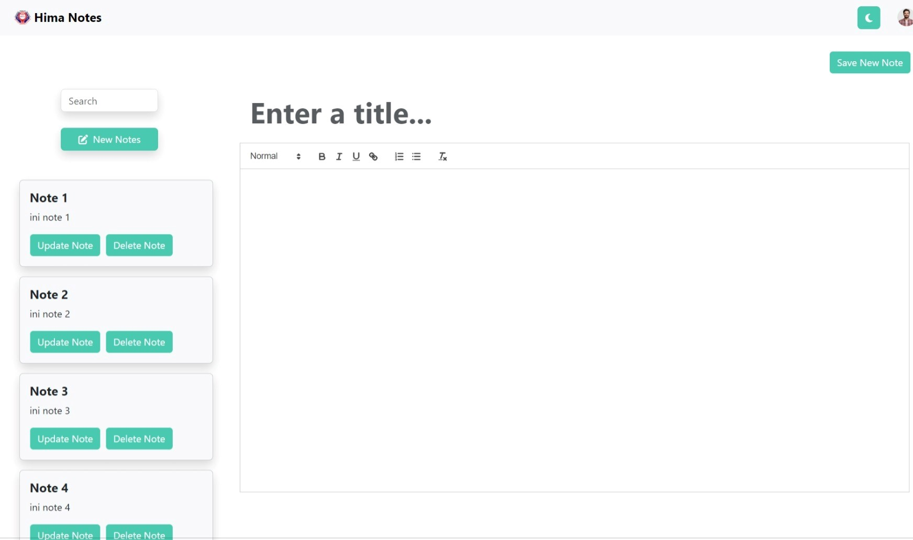
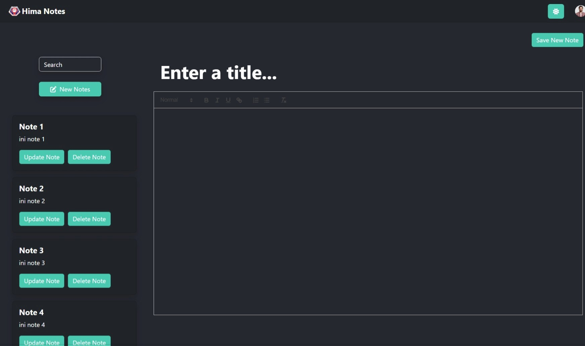

# `Note app`
## Getting Started!

install dependencies:
```bash
$ npm install
```
run development server :
```bash
$ npm start
```

<h2>Tampilan Potrait</h2>
<div align="center">
  <table>
    <tr>
      <td>
        <h6>Login</h6>
        
      </td>
      <td>
        <h6>Login</h6>
        
      </td>
    </tr>
    <tr>
      <td>
        <h6>Register</h6>
        
      </td>
      <td>
        <h6>Register</h6>
        
      </td>
    </tr>
    <tr>
      <td>
        <h6>Home</h6>
        
      </td>
      <td>
        <h6>Home</h6>
        
      </td>
    </tr>
    <tr>
      <td>
        <h6>Create</h6>
        
      </td>
      <td>
        <h6>Create</h6>
        
      </td>
    </tr>
  </table>
</div>
